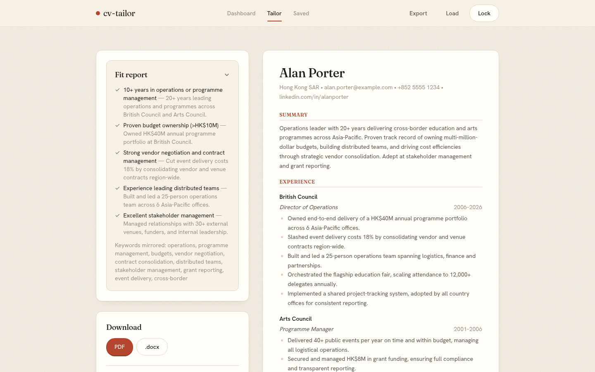
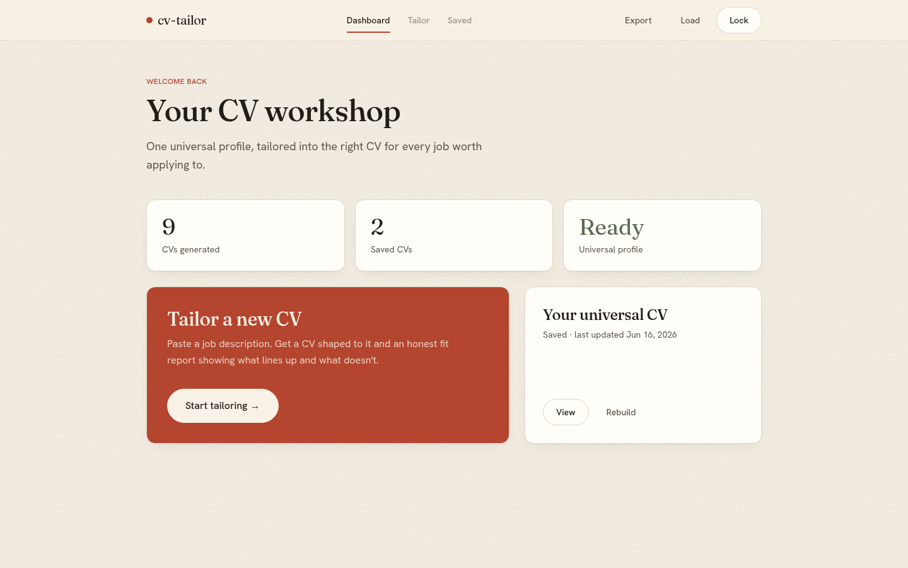
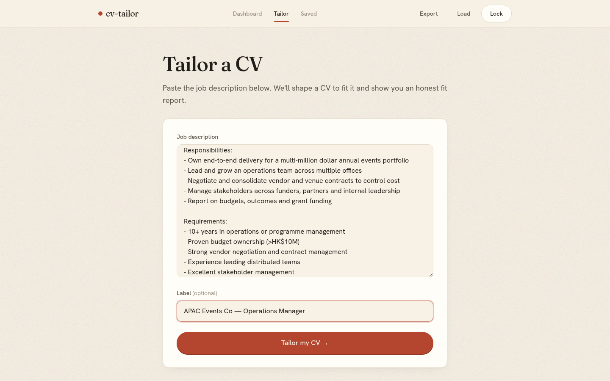
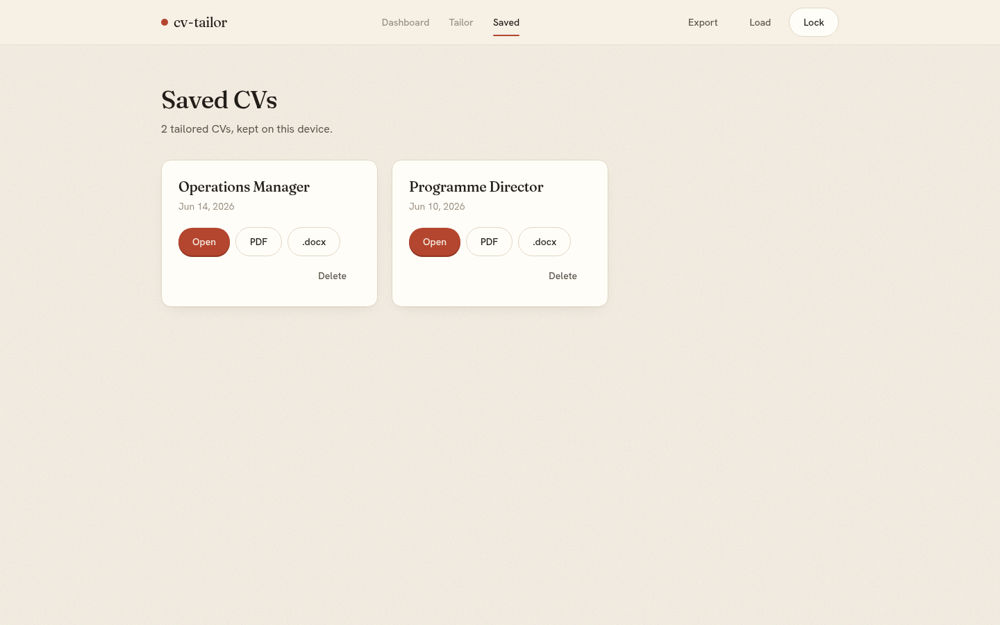
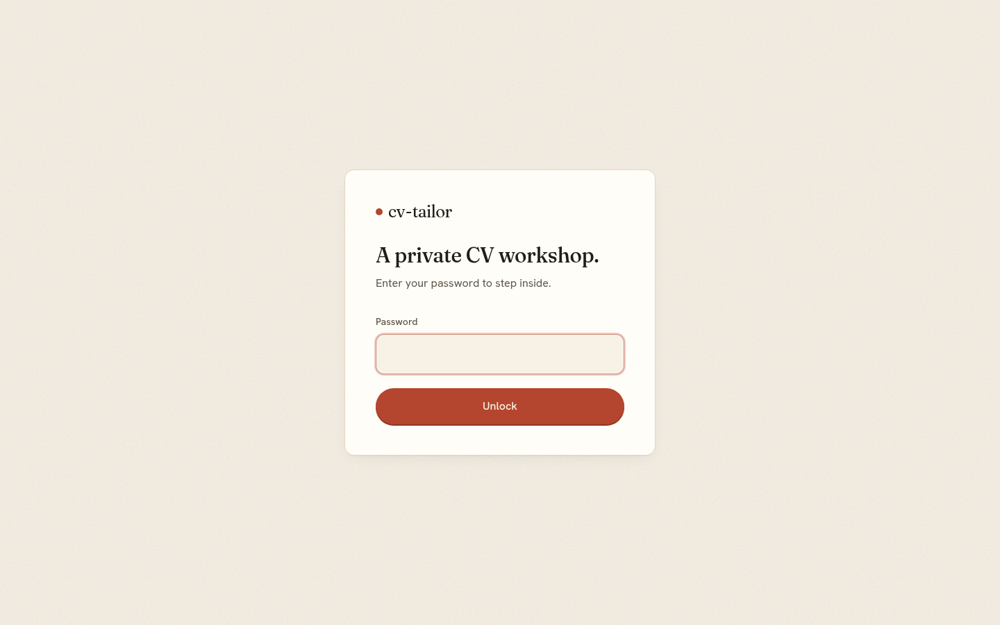

<div align="center">

# cv-tailor

**Rewrite your CV to fit a specific job — a clean PDF and an editable Word file out, plus an honest report on how well you actually match the role.**

[](LICENSE)




</div>

A small web app that rewrites your CV to fit a specific job. Paste your full career history once, paste a job description, and it gives you back a tailored one-to-two page CV as both a PDF and an editable Word file, plus a short report on how well you actually match the role.

I built this for my dad. He'd been in the same organisation for about 20 years and was applying for work again with a 7-page CV written in Word, styled like it was 2006. A recruiter looked at it for two minutes and found the real problem straight away: the content was all genuinely there, but the presentation was working against him, and half the job titles meant nothing to the people reading them. This tool fixes presentation. It does not invent anything.

## What it does

- **One master profile.** You paste your whole history (or upload your existing PDF or `.docx`) once. It stays in your browser.
- **Tailors per job.** Paste a job description and it selects, reorders, and rewords what's relevant, mirrors the keywords the role actually asks for, and cuts it down to a sensible length.
- **Real files out.** A clean single-column PDF (the kind applicant-tracking systems can actually read) and an editable `.docx` for the portals that demand Word.
- **A fit report.** What the job asks for, what you cover, and the honest gaps.
- **Refine loop.** "Make it shorter", "lean more academic", and it regenerates.
- **Standing preferences.** A notes field that rides along every time, so the output stays consistent without you repeating yourself.

## Screenshots

|  |  |
| --- | --- |
| <br>**One universal profile.** Your master CV and every tailored CV, on one page. | <br>**Paste a job.** It shapes a CV to fit and shows you an honest fit report. |
| <br>**Saved locally.** Every tailored CV stays in your browser, as PDF or Word. | <br>**Shared-password gate** keeps random visitors from burning your API key. |

## What it won't do

It won't make things up. It only ever works from what's in your master profile, so it can't add experience you don't have. It's a presentation tool, not a fiction generator. It also doesn't scrape JobsDB or LinkedIn for you. You copy the job description in by hand, which is slower but keeps you off the wrong side of their rate limits.

## How your data is handled

Everything you enter lives in your own browser (`localStorage`). There's no database and no accounts. The backend is a single stateless function that takes your text, passes it to the language model, and forgets it. The one place your CV leaves your machine is the model provider's API, so pick a provider whose data policy you're comfortable with. Use the **Back up** button to save a JSON file of your profile and saved CVs, and **Restore** to load it on another machine.

## Self-hosting

It runs anywhere that serves a static site plus serverless functions. It's built and deployed on Vercel, and the model is any OpenAI-compatible endpoint, so you bring your own key. Local setup is just three commands and no Vercel CLI — a small dev plugin serves the `api/*` functions alongside Vite, so the whole app runs from `npm run dev`.

```bash
npm install
cp .env.example .env.local   # fill in the four values below
npm run dev                  # UI + the /api functions, on http://localhost:5173
```

Four environment variables:

| Variable | What it is |
|---|---|
| `LLM_BASE_URL` | OpenAI-compatible endpoint (e.g. `https://api.deepseek.com`) |
| `LLM_API_KEY` | your key for that provider |
| `LLM_MODEL` | model name (e.g. `deepseek-chat`) |
| `APP_PASSWORD` | a shared password people type before the tool will call the model, so your key can't be abused |

DeepSeek, OpenAI, and Gemini all expose OpenAI-compatible endpoints, so swapping provider is a config change, not a code change. See `.env.example` for the exact base URLs.

To deploy, push to Vercel (or any host with serverless functions; it ports to Cloudflare Pages) with the same four environment variables set in the project.

## Stack

Vite, React, TypeScript, Tailwind. PDFs via `@react-pdf/renderer`, Word files via `docx`, uploads parsed with `pdfjs-dist` and `mammoth`. The model returns structured JSON and the rendering is done locally, which is what keeps the layout consistent and ATS-safe.

## Licence

MIT. Do what you like with it.
